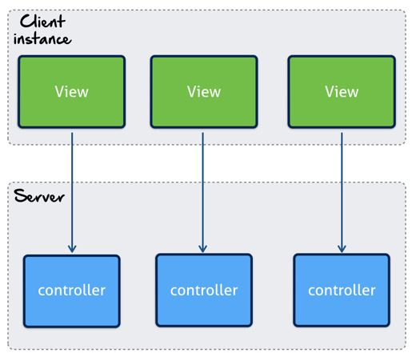
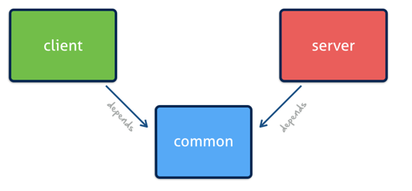
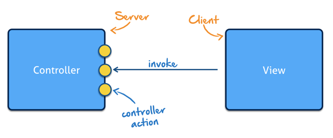
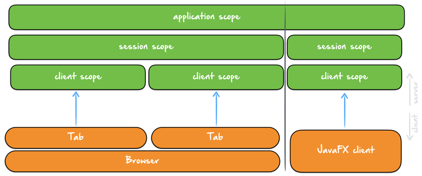

#Controller API

When using Dolphin Platform the frontend of an application is splitted in several view. For each view instance in the client a controller instance is managed in the server. 

### Defining a controller
A controller type is defined as a Java class on the server. This is done with the ``` @DolphinController ``` annotation. Each controller class on the must be annotated by using this annotation to define the class as a Dolphin Platform controller:
```java
@DolphinController
public class MyViewController {

    //...

}
```
Each controller type / class is marked by an unique identifier. If developers don't specifiy an identifier on their own the full name of the controller class is used. In the given example the controller would have the identifier ``` com.company.app.controller.MyViewController ``` (if it's part of the ``` com.company.app.controller ``` package). In general it's a better to specify an identifier for the controller class since refactoring (like moving the controller class in a different package) can change its identifier. A custom identifier for a controller can simply be definied by using the ``` @DolphinController ``` annotation:
```java
@DolphinController("ViewController1")
public class MyViewController {

    //...

}
```
In this example the controller has the unique identifier ``` ViewController1 ```. When defining custom names for the controllers it's important to always specifiy a controller name that is unique in the whole application. Since the identifier is used on the client to access a specific controller type it's best practice to define the controller names as constants in a module that is shared between client and server (both depend on the module). 

All the constants can easily be specified in an interface, for example:
```java
public interface ControllerConstants {

    public static final String CONTROLLER1_NAME = "MyViewController";
    
    public static final String CONTROLLER2_NAME = "ViewController2";

}
```
By doing so the constants can easily be used to specifiy the identifier of a controller:
```java
@DolphinController(ControllerConstants.CONTROLLER1_NAME)
public class MyViewController {

    //...

}
```
### Defining the model
Since the view and the controller share a model it's important that the controller knows about the model. To do so the model type must be specified in the controller class. Whenever a controller will be created the model will automatically be injected in the controller. To define the model in the controller Dolphin Platform provides the ``` @DolphinModel ``` annotation. By using this annotation the related model type can be specified in a controller and simply injected at runtime:
```java
@DolphinController(ControllerConstants.CONTROLLER1_NAME)
public class MyViewController {

    @DolphinModel
    private MyModel model;

}
```
How a model can be specified and how it can be used on the client and the server can be found in the documentation of the model API.
### Controller actions
Actions are endpoints of the controller that can be triggered by the view. For example this can happen when a user clicks a button in the client. This button action will than trigger an action in the server controller instance that maybe stores some date in the database or refresh the model. 

A controller action is defined as a method in the controller that is annotated by ``` @DolphinAction ```:
```java
@DolphinController(ControllerConstants.CONTROLLER1_NAME)
public class MyViewController {
 
    @DolphinModel
    private MyModel model;
    
    @DolphinAction
    public void onAction() {
        System.out.println("Action was triggered!");
    }

}
```
Because the action will be triggered by the client it must be specified by an identifier. This identifier must be unique in the given controller type. By default the name of the method will be used but as descriped for the ``` @DolphinController ``` annotation it's best practice to specify a custom constant name to avoid refactoring issues:
```java
@DolphinController(ControllerConstants.CONTROLLER1_NAME)
public class MyViewController {
 
    @DolphinModel
    private MyModel model;
    
    @DolphinAction(ControllerConstants.ACTION1_NAME)
    public void onAction() {
        System.out.println("Action was triggered!");
    }

}
```
Sometimes it's necessary to submit parameters to the server action. Like controllers and actions parameters must be specified by an identifier. To define the identifier for a parameter of the action Dolphin Platform provides the ``` @Param ``` annotation that must be added to each parameter of the action method:
```java
@DolphinController(ControllerConstants.CONTROLLER1_NAME)
public class MyViewController {
 
    @DolphinModel
    private MyModel model;
    
    @DolphinAction(ControllerConstants.ACTION1_NAME)
    public void onAction(@Param("id") String id) {
        System.out.println("Action was triggered for id " + id);
    }

}
```
Even if in this example only one parameter is defined the Dolphin Platform actions support any count of parameters. Here it's only important that each parameter has a unique identifier in the context of the action and that the parameter are of a supported type. Currently Dolphin Platform supports the following types for parameters: ``` Integer ```, ``` Long ```, ``` Double ```, ``` Float ```, ``` Boolean ```, ``` String ```. It's best practice to not use primitives here since null values are always supported and can end in an Exception since Java autoboxing can't convert null to a primitive number or boolean. Some additional common types like ``` Date ``` will be added in future releases.
### Benefits of managed controllers
Since a controller is always created and managed by the underlying platform (like Spring or JavaEE) a developer don't need to care about controller and model creation. The last sample already defines a full useable controller that will automatically be created (and a new model instance will be injected) whenever the related view is created on the client.
Next to this the controller offers all the benefit that a managed beans offers based on the underlying platform. Based on this it's no problem to use CDI If Dolphin Platform is used in a JavaEE environment. In addition default annotations like ``` @PostConstruct ``` and ``` @PreDestroy ``` are supported. The following example shows how such a controller could look like:
```java
@DolphinController(ControllerConstants.CONTROLLER1_NAME)
public class MyViewController {
 
    @DolphinModel
    private MyModel model;
    
    @Inject
    private MyService service;
    
    @PostContruct
    public void init() {
        System.out.println("Hello");
    }

    @PreDestroy
    public void shutdown() {
        System.out.println("Bye, bye");
    }

}
```
It's important to know that even if a controller instance is a managed object it can not be injected in any other managed bean. This belongs on some restrictions in the Dolphin Platform Architecture: Even if the lifecycle of a controller is well defined it's possible to have several instances of the same controller. Let's say your frontend contains a tabbed pane and you have 2 instances of the same view in this pane. By doing so it's not possible to specify what controller instance should be injected in bean. For a future release of Dolphin Platform it's planned to define parent-child-relations between controller instances. Currently the Dolphin Platform event bus should be used for communication between controllers and / or additional services.
### Definition of the client scope
Dolphin Platform provides an additional custom Scope called ``` ClientScope ```. This scope is currently implemented for JavaEE and Spring and it's defined as a scope that is "lower than the session scope". This scope is important if you want to create web application, for example. Since all the tabs of a browser share the same session it's hard to define data that is only related to one tab in the browser. In that case the lifecycle of a client scope is bound to a tab in the browser and ends when the tab will be closed.

For both JavaEE and Spring a ``` @ClientScoped ``` annotation is defined that can be used to give any bean the specific scope:
```java
@ClientScoped
public class MyLocalStoreService {
 
    private List<String> values = new ArrayList();
    
    public void add(String val) {
        values.add(val);
    }

}
```
The given service can now simply be injected in any controller:
```java
@DolphinController(ControllerConstants.CONTROLLER1_NAME)
public class MyViewController {
 
    @DolphinModel
    private MyModel model;
    
    @Inject
    private MyLocalStoreService service;
    
}
```
Internally the client scope is defined by an unique identifier that is shared between client and server with each request. Based on this the scope only "lives" inside a Dolphin Platform request roundtrip. At the moment this means that beans that are defined for the client scope can only be injected in Dolphin Platform controller classes or classes that are (transitive) injected in controllers. For a future release we plan to support general HTTP endpoints that can be called from a client and "live" in the client scope. This will be usefull to provide specific content like images or files to the client.
