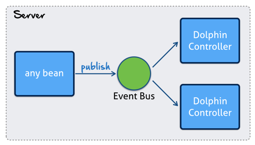
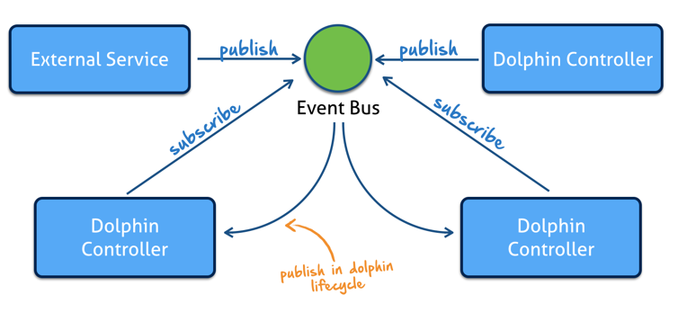

#The Event Bus
Dolphin Platform provides an event bus that can be used to send events to client sessions on the server. by doing so it's quite easy to create dynamic application with the Dolphin Platform that automatically propagate informations to several clients. A good example for such an application is a messaging app in that all messages that are typed by a user will be directly visible in the client instances of several other users.
### General overview of the event bus
The event bus of Dolphin Platform can only be used on the server. It's part of the basic server module (``` dolphin-platform-server ```) and therefore no special dependencies need to be added to a Dolphin Platform application to use the event bus. The event bus implements the publish-subscribe-pattern and can be used to send events to all subsribers of a specific topic.

To do so a Dolphin Platform controller (or other beans that life in the Dolphin Platform client scope) can be registered as subscriper for a specific topic. Any managed bean of an application can send custom events to a defined topic. By doing so all subscripers will be notified and receive the event. The event can contain custom data which allows a developer to send informations to several controller instances.

### Defining a topic
As already mentioned the Dolphin Platform event bus is topic based. This means that all event must be published to a specified topic and all receivers are always subscribed to a topic. In Dolphin Platform the the topic is not simply defined by a String but by the ``` Topic<E> ``` class. By doing so the topic can already define what types of data can be send to this topic based on the generic identifier. Since topics are used at the publsiher and the receiver site it's best practice to define them as constants. Here is an example how topics can be specified:
```java
public interface EventTopics {

    public static final Topic<String> DESCRIPTION_ADDED_TOPIC = new Topic();
    
    public static final Topic<MyCustomBean> DATA_CHANGED_TOPIC = new Topic();

}
```
In this example only items of type ``` MyCustomBean ``` can be send to the ``` DATA_CHANGED_TOPIC ``` topic. Internally the topic uses an unique identifier for specification. A developer can define it's own identifer by simply passing a ``` String ``` to the constructor of the ``` Topic ```. This is usefull for debugging since you can see a readable name of the topic but in that case a developer must check that all topics have unique identifiers:
```java
public interface EventTopics {

    public static final Topic<String> DESCRIPTION_ADDED_TOPIC = new Topic("descriptionAddedTopic");
    
    public static final Topic<MyCustomBean> DATA_CHANGED_TOPIC = new Topic("dataChangedTopic");

}
```
### Sending an event
The Dolphin Platform provides a injectable ``` DolphinEventBus ``` bean that must be used to send an event to a topic. By doing so each bean that is managed by the underlying container (like Spring or JavaEE) can publish events. To publish an event you always need to define the topic to that the event should be published. In addition data can be send as part of the event message. Publishing an event is a non-blocking operation. Here is an example how a event can be send to a specific topic:
```java
@ApplicationScoped
public class MyLocalStoreService {
 
    @Inject
    private DolphinEventBus eventBus;
    
    public void addDescription(String desc) {
        eventBus.publish(EventTopics.DESCRIPTION_ADDED_TOPIC, desc);
    }

    public void updateData(MyCustomBean data) {
        eventBus.publish(EventTopics.DATA_CHANGED_TOPIC, data);
    }


}
```
In this example the previously created topics are used. As you can see data of the type that is defined in the generic identifier of the ``` Topic<E> ``` instances is send to the topic. Sending another type of data (an instance of a different class) will end in a compiler exception.
### Receiving events
To receive events of a specific topic the receiver must subscribe itself to the topic. This is done by adding a message listener to the topic. This listener will be called whenever a new event was published for the given topic. Since the event handling is always done in a Dolphin Platform communication roundtrip a event receiver must be a Dolphin Platform controller or a managed bean that is defined by the client scope. The following controller class shows how a subscription camn be done:
```java
@DolphinController(ControllerConstants.CONTROLLER_NAME)
public class MyViewController {
 
    @DolphinModel
    private MyModel model;
    
    @Inject
    private DolphinEventBus eventBus;
    
    @PostContruct
    public void init() {
        eventBus.subscribe(EventTopics.DATA_CHANGED_TOPIC, e -> {
                System.out.println("Data changed: " e.getData().getName();
        });
        
        eventBus.subscribe(EventTopics.DESCRIPTION_ADDED_TOPIC, e -> {
                model.getDescriptions().add(e.getDate());
        });
    }
}
```
As you can see the listener can simply access the data that was send to the topic by using ``` event.getData() ```. Thanks to the typesavity of the event bus the data don' t need to be casted to the needed type. In the example you can see one big benefit of the event bus: Since all Dolphin Platform model instances will automatically be shared and synchronized between client and server the changes of the model that are done in the subscription of the ``` DESCRIPTION_ADDED_TOPIC ``` topic will automatically be snychronized with the client and can trigger an update of the UI. By doing so it's quite easy to update several clients dynamically based on events.
The ``` DolphinEventBus ``` don't provide a method to unregister subscriptions. Instead of this the ``` subscribe(...) ``` methods returns an object of type ``` Subscription ```. THis object can easily be used to unsubscribe from a topic. By doing so the following code defines a controller that can be dynamically subscriped and unsubscriped from a topic:
```java
@DolphinController(ControllerConstants.CONTROLLER_NAME)
public class MyViewController {
 
    @DolphinModel
    private MyModel model;
    
    @Inject
    private DolphinEventBus eventBus;
    
    private Subscription subscription;
    
    @DolphinAction
    public void activateLiveUpdates() {
        if(subscription != null) {
            subscription = eventBus.subscribe(EventTopics.DESCRIPTION_ADDED_TOPIC, e -> {
                    model.getDescriptions().add(e.getDate());
            });
        }
    }
    
    @DolphinAction
    public void deactivateLiveUpdates() {
        if(subscription != null) {
            subscription.unsubscribe();
            subscription = null;
        }
    }
}
```
### Use-cases for the event bus
There are several use cases and scenarios that can simply be developed by using the Open Dolphin event bus. 
TODO