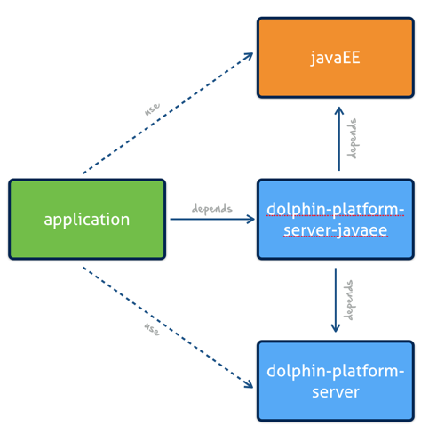

#JavaEE Integration
Even if mostly all of the public server APIs of the Dolphin Platform don't depend on the underlying container implementation a special dependency must be added to a project that is created as a JavaEE based application.

The ``` dolphin-platform-server-javaee ``` dependency adds the Dolphin Platform server API and JavaEE APIs as transitive dependencies. For a maven based project a minimum  ``` pom.xml ``` looks like this:
```xml
<?xml version="1.0" encoding="UTF-8"?>
<project xmlns="http://maven.apache.org/POM/4.0.0"
         xmlns:xsi="http://www.w3.org/2001/XMLSchema-instance"
         xsi:schemaLocation="http://maven.apache.org/POM/4.0.0 http://maven.apache.org/xsd/maven-4.0.0.xsd">
    <modelVersion>4.0.0</modelVersion>

    <groupId>com.canoo.sample</groupId>
    <artifactId>server</artifactId>
    <version>1.0.0-SNAPSHOT</version>

    <dependencies>
        <dependency>
            <groupId>com.canoo.dolphin-platform</groupId>
            <artifactId>dolphin-platform-server-javaee</artifactId>
            <version>0.8.3</version>
        </dependency>
    </dependencies>

</project>
```
In most cases you will define the model classes in a seperate module that is shared between client and server and server must be added as a second dependency to your application.
Once you start the server application the Dolphin Platform bootstrap will automatically initialized.
### Configuration of the application
The Dolphin Platform part of the application can be configured a ``` dolphin.properties ``` file. This file is not JavaEE specific and therefore it's described in the general server part.
### Next steps
When developing a Dolphin Platform application with JavaEE you can use all the benefits of both worlds. This means that you can simply define CDI beans and inject them in Dolphin Platform controllers. A general overview of the Dolphin Platform server API can be found here.
### Using the jumpstart
Dolphin Platform provides several Maven archetypes to quickly create a full client server application. By doing so you only need an installed Maven on your system and can run the following command on a shell:
```shell
mvn archetype:generate -Dfilter=com.canoo.dolphin-platform:
```
This will start a Maven build that creates a full client-server Maven project for you. A full documentation of the jumpstart can be found here.