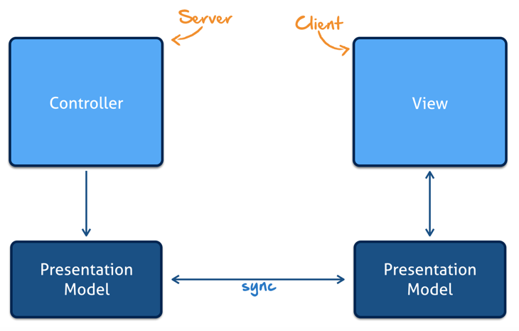

#The Model API
One of the core features and maybe the most important concept of Dolphin Platform is the model synchronization between client and server. For each view in the client a controller instance "lives" in the server that defines all the logic of the view. A model is automatially shared and synchronized between the client view and the controller on the server.

Such a model can be a bean or a hierarchy of several beans. Dolphin Platform provides an API to create full observable beans for the model layer.
###Create a bean
A model for the Dolphin Platform can simply be defined as a Java bean but instead of using primitive date types for all the attributes of the bean Dolphin Platform provides the ``` Property<V> ``` interface that should be used to define attributes. Based on this a definition for a bean with only one String attribute will look like this:
```java
@DolphinBean
public class MyModel {

    private Property<String> value;
    
    public Property<String> valueProperty() {
        return value;
    }
    
    public String getValue() {
        return value.get();
    }
   
    public void setValue(String value) {
           this.value.set(value);
    }

}
```