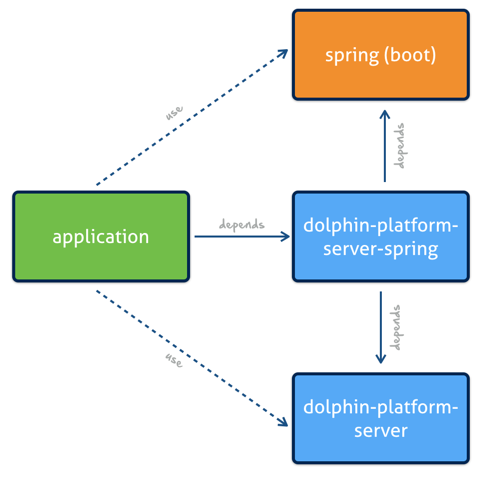

#Spring Integration
Even if mostly all of the public server APIs of the Dolphin Platform don't depend on the underlying container implementation a special dependency must be added to a project that is created as a Spring (Boot) application.

The ``` dolphin-platform-server-spring ``` dependency adds the Dolphin Platform server API and Spring as transitive dependencies. For a maven based project a minimum  ``` pom.xml ``` looks like this:
```xml
<?xml version="1.0" encoding="UTF-8"?>
<project xmlns="http://maven.apache.org/POM/4.0.0"
         xmlns:xsi="http://www.w3.org/2001/XMLSchema-instance"
         xsi:schemaLocation="http://maven.apache.org/POM/4.0.0 http://maven.apache.org/xsd/maven-4.0.0.xsd">
    <modelVersion>4.0.0</modelVersion>

    <groupId>com.canoo.sample</groupId>
    <artifactId>server</artifactId>
    <version>1.0.0-SNAPSHOT</version>

    <dependencies>
        <dependency>
            <groupId>com.canoo.dolphin-platform</groupId>
            <artifactId>dolphin-platform-server-spring</artifactId>
            <version>0.8.3</version>
        </dependency>
    </dependencies>

</project>
```
In most cases you will define the model classes in a seperate module that is shared between client and server and server must be added as a second dependency to your application.
### Defining the main class of the application
To start your Spring Boot based server a class with a main method need be be defined. In the main method Spring must be started. In addition the Dolphin Platform bootstrap must be configured and initalialized. To do so Dolphin Platform provides the ``` @DolphinPlatformApplication ``` annotation that must be added to the main class to automatically load all needed configurations and trigger the Dolphin Platform Bootstrap. Based on the annotation a main class will always looks like this:
```java
@DolphinPlatformApplication
public class ServerMain {

    public static void main(String... args) {
        SpringApplication.run(ServerMain.class, args);
    }

}
```
### Configuration of the application
The server application can be configured by using all the possibilities that Spring offers for configuration. In addition a ``` dolphin.properties ``` file can be used to define a configuration for the Dolphin Platform part of the server. This file is not Spring specific and therefore it's described in the general server part.
### Next steps
When developing a Dolphin Platform application with Spring you can use all the benefits of both worlds. This means that you can simply define Spring components and service and inject them in Dolphin Platform controllers. A general overview of the Dolphin Platform server API can be found here.
### Using the jumpstart
Dolphin Platform provides several Maven archetypes to quickly create a full client server application. By doing so you only need an installed Maven on your system and can run the following command on a shell:
```shell
mvn archetype:generate -Dfilter=com.canoo.dolphin-platform:
```
This will start a Maven build that creates a full client-server Maven project for you. A full documentation of the jumpstart can be found here.